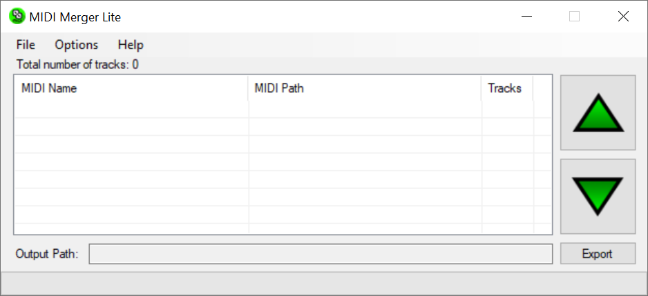

# MIDI Merger Lite

## Overview

MIDI Merger Lite is a simple, lightweight program that merges tracks from multiple MIDI files into one MIDI file.

## Usage

1. Click the "Add MIDIs" item under the File Menu to populate the list with MIDI files to be merged, or simply drag and drop MIDI files or folders containing MIDI files to populate the list as well (MIDIs in subdirectories will also be added to the list).

2. Merge order is based on the order of the MIDI files that appear in the list (i.e. The MIDI file that appears at the very top of the list will be merged first, while the MIDI file that appears at the very bottom of the list will be merged last). To change the merge order of the MIDI files, select one or multiple files from the list and use the arrow buttons to move the items up or down the list.

3. Click the "Export" button and enter in the desired name for the output MIDI file to be saved under.

4. **Optional:** In the options menu, you can choose whether or not to skip the first track of all MIDI files other than the very first MIDI file that appears in the list. This may be useful if all of the MIDI files in the list have the first track as a setup track with the same or similar data as one another, but only want to have one setup track instead of several.

5. When finished configuring, select the "Merge MIDIs" item under the File Menu to begin merging the MIDI files.

## Limitations

- Only MIDIs created under the MIDI 1.0 specification are supported
- Only Format 1 MIDI files are supported
- Output MIDI file cannot contain more than 65535 tracks (a limitation of the MIDI 1.0 specification)
- All MIDIs that are being merged must have the same time divisions (i.e. A MIDI file with 384 ticks per bar cannot be merged with a MIDI file with 1920 ticks per bar)
	- You can use the [MIDI Time Division Reader](https://github.com/VirtuosicAI/MIDI-Time-Division-Reader) program to check time division of MIDI files

## Frequently Asked Questions (FAQs)

### Can I run this program on Mac or Linux?
MIDI Merger Lite does not have native support for MacOS or Linux and is currently a Windows only application. However, there are plans to add cross-platform support in the future to support those operating systems.

### The merged MIDI file plays too slow/fast. Why is this happening?
This issue occurs when one or more MIDI files being merged do **not** have the same time division as the others. Please verify that all of the MIDI files have the same time division value using the [MIDI Time Division Reader](https://github.com/VirtuosicAI/MIDI-Time-Division-Reader/releases/download/v1.0.0.1/MIDI.Time.Division.Reader.x86_64.zip) program before merging.

**Note: The time division of a MIDI file is not the same as the tempo nor time signature Meta Event.**

One way to ensure that all MIDI files have the same time division is to try re-exporting them in your preferred MIDI editor. If your MIDI editor does not change the time division of the MIDI files, try using a different MIDI editor such as [FL Studio](https://www.image-line.com/) (you can use the free trial version to do this).

### Is there a limit to how large of a MIDI file that this program can handle?
The theoretical maximum MIDI file size that this program can output is **127.998 TiB** or **140.735 TB.** This should not be an issue for users as it is far beyond the maximum memory limit of consumer-grade hardware to be of practical use with other MIDI software.

## References

To learn more about the MIDI 1.0 specification, visit the links below:
- MIDI File Format Specifications: https://github.com/colxi/midi-parser-js/wiki/MIDI-File-Format-Specifications
- The MIDI File Format: http://www.personal.kent.edu/~sbirch/Music_Production/MP-II/MIDI/midi_file_format.htm
